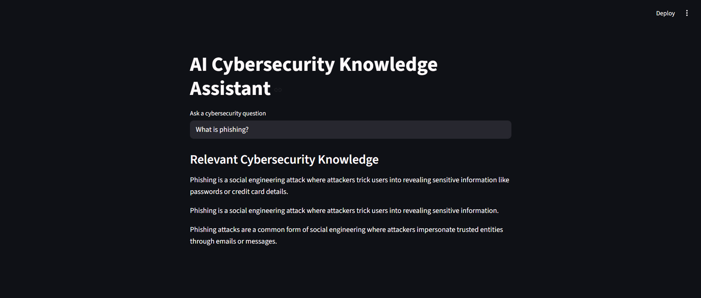
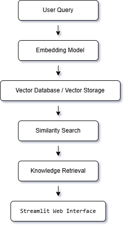

# AI Cybersecurity Knowledge Assistant (Semantic Search with Vector Embeddings)


## Overview

The **AI Cybersecurity Knowledge Assistant** is an intelligent application designed to help users quickly understand cybersecurity concepts through **semantic search and vector embeddings**.

Instead of relying on simple keyword matching, the system uses **vector similarity search** to understand the meaning of a user's question and retrieve the most relevant cybersecurity knowledge.

This project demonstrates a **Retrieval-Augmented Knowledge System** where cybersecurity information is retrieved from a vectorized knowledge base and presented to the user through an interactive interface.

---

## Problem Statement

Cybersecurity information is vast and complex. Many users struggle to quickly find clear explanations of security threats such as phishing, malware, ransomware, and insider threats.

Traditional keyword-based search systems often fail to retrieve the most relevant information when the query wording differs from the stored data.

This project solves the problem by implementing **semantic search**, allowing the system to understand user intent and retrieve the most relevant cybersecurity concepts.

---

## Key Features

* Semantic search using vector embeddings
* Retrieval-based cybersecurity knowledge assistant
* Real-time question answering interface
* Vector similarity ranking for relevant information
* Lightweight AI pipeline running locally
* Interactive web interface built with Streamlit

---

## Example Interaction

User Question:

```
How do hackers steal passwords through fake emails?
```

System Retrieval:

```
Phishing is a social engineering attack where attackers trick users into revealing sensitive information such as passwords or credit card details.
```

The system retrieves the **most semantically similar cybersecurity concept**, even if the exact keywords are different.



---

## System Architecture



This architecture demonstrates a **semantic retrieval pipeline**, commonly used in modern AI systems.

---

## Technology Stack

| Component            | Technology            |
| -------------------- | --------------------- |
| Programming Language | Python                |
| Web Interface        | Streamlit             |
| Embedding Model      | Sentence Transformers |
| Vector Search        | NumPy Similarity      |
| Knowledge Base       | Cybersecurity Dataset |

---

## How the System Works

1. The user submits a cybersecurity question.
2. The question is converted into a vector embedding using a Sentence Transformer model.
3. The embedding is compared with stored knowledge vectors.
4. The system retrieves the most relevant cybersecurity concepts based on similarity scores.
5. The retrieved knowledge is displayed through the user interface.

---

## Project Structure

```
cyber-ai-assistant
│
├── app.py
├── ingest.py
├── cybersecurity.txt
├── vectors.json
├── requirements.txt
└── README.md
```

---

## Setup Instructions

### Clone the Repository

```
git clone https://github.com/your-username/your-repo-name.git
```

### Navigate to Project Folder

```
cd cyber-ai-assistant
```

### Install Dependencies

```
pip install -r requirements.txt
```

### Generate Vector Embeddings

```
python ingest.py
```

### Run the Application

```
python -m streamlit run app.py
```

---

## Example Use Cases

The system can answer questions related to:

* Phishing attacks
* Malware and ransomware
* Insider threats
* Social engineering
* Ethical hacking
* Cybersecurity awareness

---

## Future Enhancements

Potential improvements include:

* Integration with large vector databases such as Endee
* Adding large-scale cybersecurity datasets
* Incorporating large language models for dynamic response generation
* Implementing conversational chat interfaces
* Supporting real-time threat intelligence data

---

## Author

**Boya Karthik**

LinkedIn:
[www.linkedin.com/in/boyakarthik](http://www.linkedin.com/in/boyakarthik)

---

## Project Purpose

This project was developed to demonstrate **semantic search and vector retrieval systems** in the context of cybersecurity knowledge discovery.


